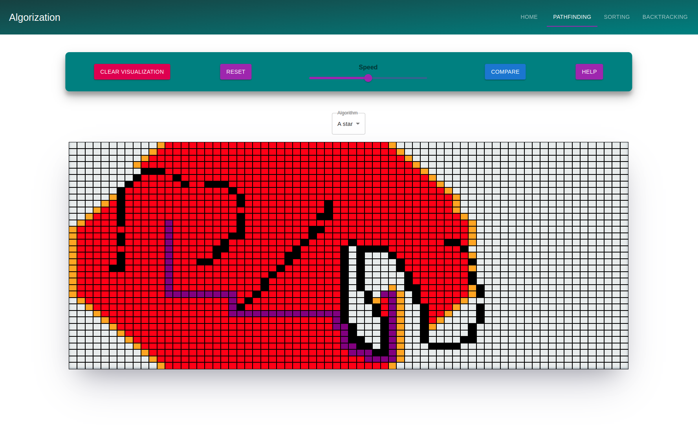
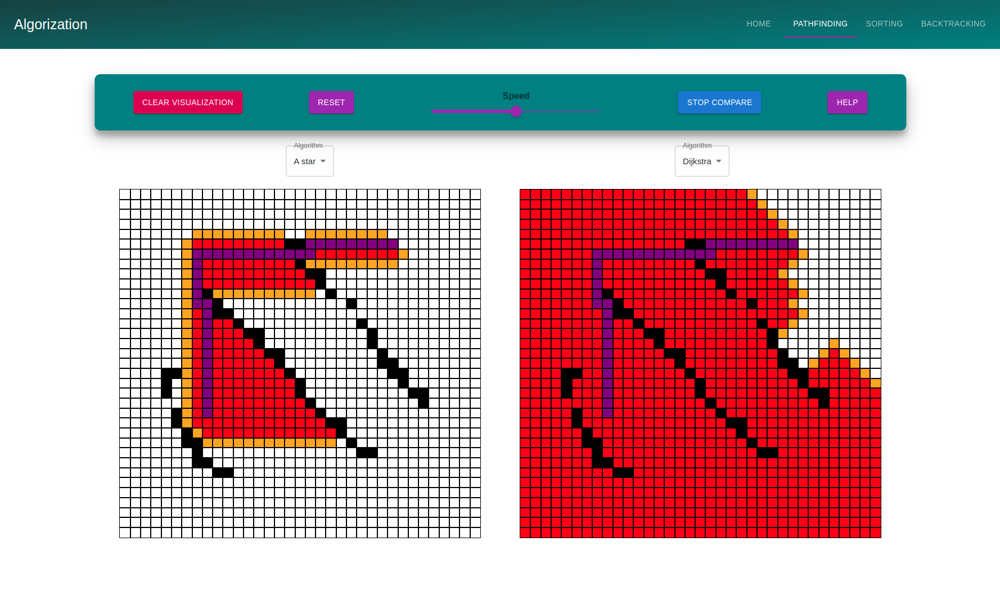
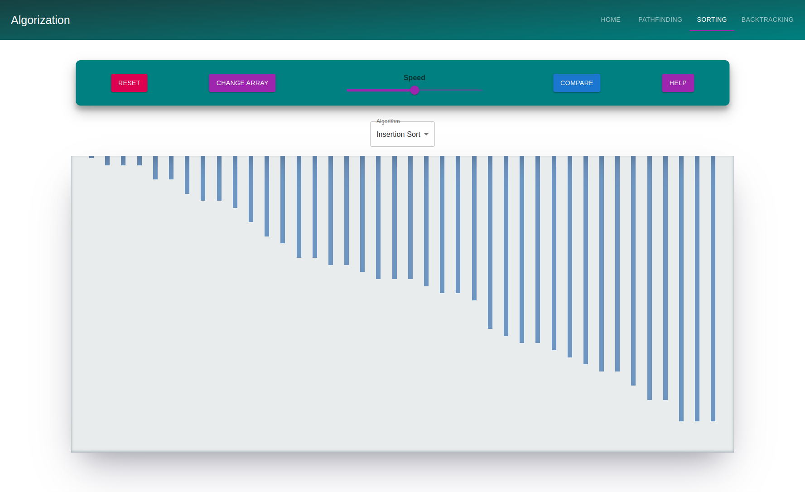
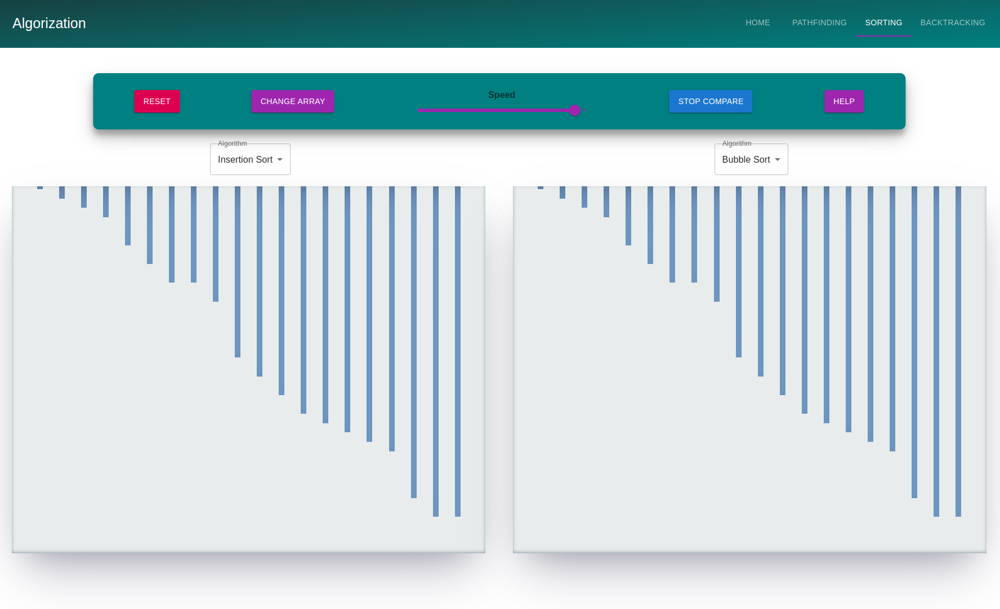
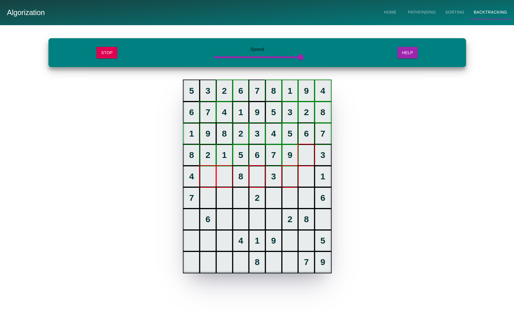

# Algorization, the best web algorithm visualization tool

This project is a web application to visualize sorting, pathfinding and backtracking algorithms. I did this project to learn more on algorithms and to get better in frontend development. I did this application with React and Typescript.  

## Installation 

* Download the source code
* run npm install
* run npm start

## Quick look

**Pathfinding page**

**Pathfinding compare page**

**Sorting page**

**Sorting compare page**

**Backtracking page**

